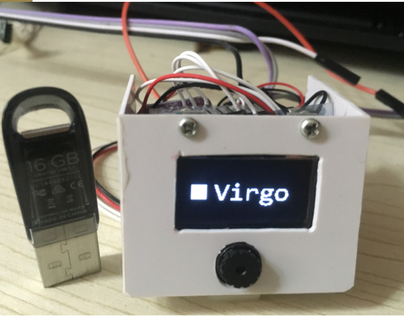
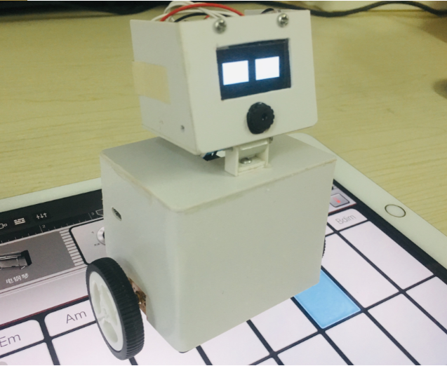

# Robot - K1 Virgo
> The project is a desktop robot, Its named K1, and nickname is Virgo.

- He is a very small robot, has a self-balance body.
- parts: camera, wifi, lcd ...

## Show

## Hardware
- the core brain : esp32

## TODO
| TODO | STATUS |
| --- | :---: |
| eye emotion | yes|
| mp3 player | no |
| speech recognition  | no |
| photo | no |
| ota | no |
| web service | no |
| remote control | no |

## About
> Me

    Author     : Kevin Wei
    Profession : Embedded software engineer(Linux)
    Industry   : AI, Robot, IOT
    Email      : kkcoding@qq.com

> My Home - **[www.xweikk.com](http://www.xweikk.com:8080) (developing)**

[B站展示视频](https://space.bilibili.com/427666063)

> More
    
- 作者以C/C++为主要技术栈，其他辅助了解python、java、Android、后端和前端技术。个人网站是我慢慢摸索开发的(Java, Html)。
- 作者毕业时从事硬件设计工作，后来才转到Linux相关的软件开发，所以对硬件也稍有了解。
- 虽然有全栈的趋势，但我还是忠于C/C++，常说“语言只是工具”，重要的是解决问题的能力。
